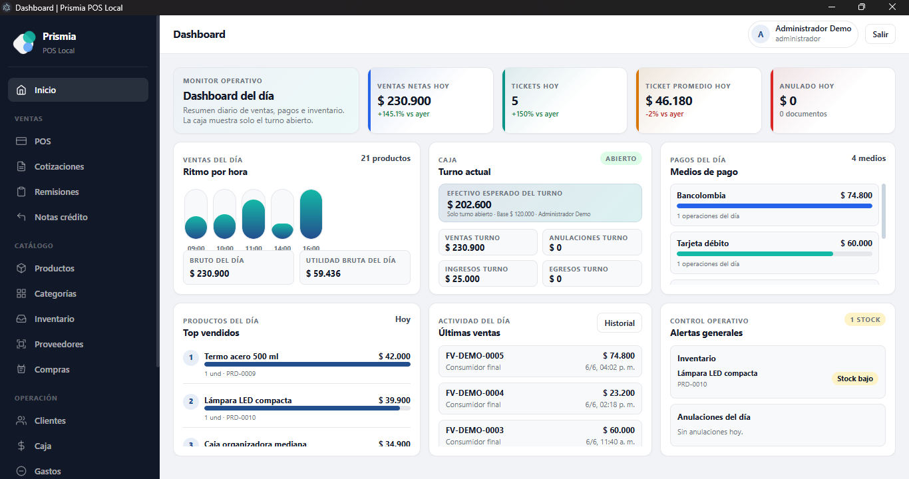
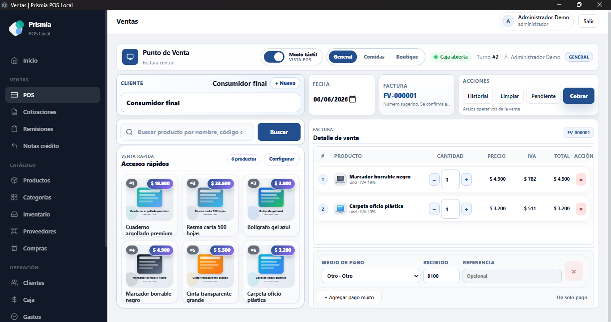
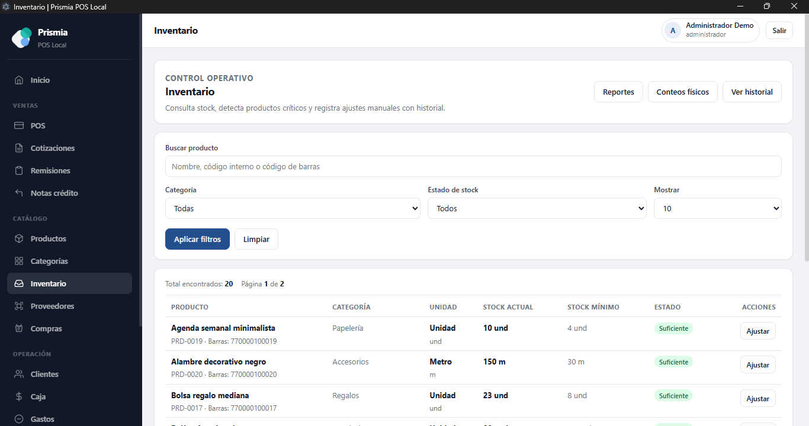
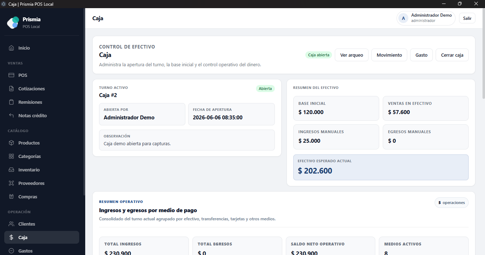

# Prismia POS Local

**Sistema de punto de venta de escritorio para pequeños y medianos negocios.**

Prismia POS Local es una aplicación para Windows orientada a la gestión diaria de un negocio: ventas, caja, inventario, compras, clientes, proveedores y documentos comerciales, con funcionamiento local y sin depender de una conexión permanente a internet ni de un servidor externo de base de datos.

> **Estado actual:** V1 funcional en cierre pre-piloto, preparada para pruebas reales controladas.

<p>
  <a href="https://prismia-landing.nievessystems.workers.dev/"><strong>Ver sitio de Prismia</strong></a>
  ·
  <a href="docs/manuales/README.md"><strong>Documentación</strong></a>
  ·
  <a href="docs/LICENCIAMIENTO_PRISMIA_V1.md"><strong>Licenciamiento V1</strong></a>
</p>

---

## Vista del producto

<p align="center">
  
  
</p>

<p align="center">
  
  
</p>


---

## ¿Qué permite hacer?

### Operación comercial

- Registrar ventas desde un POS pensado para escritorio y uso táctil.
- Buscar productos y trabajar con carrito de venta.
- Manejar distintos métodos de pago y pagos mixtos.
- Generar tickets de venta.
- Consultar historial de ventas.
- Crear cotizaciones, remisiones y notas crédito.

### Caja

- Abrir y cerrar caja.
- Registrar base inicial.
- Manejar movimientos de caja.
- Relacionar pagos y ventas con la caja.
- Identificar diferencias al cierre.

### Productos e inventario

- Crear y editar productos y categorías.
- Manejar unidades de medida.
- Registrar costo, precio de venta e IVA.
- Gestionar códigos internos, SKU o código de barras.
- Controlar stock y stock mínimo.
- Realizar ajustes y conteos físicos.
- Consultar historial y diferencias de inventario.
- Importar y exportar información mediante Excel.

### Compras, clientes y proveedores

- Registrar compras.
- Asociar proveedores y detalles de compra.
- Manejar estados de pago, saldos y abonos.
- Administrar clientes y proveedores.
- Relacionar la información comercial con ventas, compras y documentos.

### Backups y operación local

- Crear backups.
- Validar backups antes de restaurarlos.
- Generar un backup de emergencia previo a una restauración.
- Restaurar base de datos y archivos asociados.
- Conservar los datos del negocio aunque la aplicación sea desinstalada.
- Trabajar con almacenamiento local mediante SQLite.

---

## Licenciamiento V1

Prismia incorpora un sistema de licenciamiento local pensado para una primera etapa comercial y piloto.

Actualmente contempla:

- prueba local inicial;
- período de gracia;
- bloqueo operativo cuando la licencia deja de ser válida;
- activación manual;
- códigos de activación firmados offline;
- validación mediante firma digital;
- asociación de la licencia a la huella del equipo;
- control de vigencia;
- protección frente a reutilización de códigos;
- auditoría de activaciones;
- solicitud de renovación mediante WhatsApp.

La aplicación instalada contiene únicamente la **clave pública** utilizada para validar códigos. La clave privada utilizada para firmarlos se mantiene fuera del software distribuido y fuera del repositorio.

La documentación técnica completa se encuentra en:

[`docs/LICENCIAMIENTO_PRISMIA_V1.md`](docs/LICENCIAMIENTO_PRISMIA_V1.md)

---

## Stack técnico

| Área | Tecnologías |
| --- | --- |
| Backend | Node.js, Express |
| Frontend | EJS, JavaScript, CSS |
| Base de datos | SQLite, better-sqlite3 |
| Desktop | Electron |
| Empaquetado | electron-builder, NSIS |
| Sesiones y seguridad | express-session, bcryptjs, Helmet |
| Archivos | multer, archiver, adm-zip |
| Importación / exportación | xlsx |
| Control de versiones | Git, GitHub |

SQLite permite instalar Prismia sin exigir al cliente MySQL, PostgreSQL u otro servidor de base de datos adicional.

---

## Sobre el proyecto

Prismia nació como un proyecto personal orientado a construir una solución de punto de venta que pudiera evolucionar hacia un producto distribuible para pequeños negocios.

El desarrollo no se limitó al flujo de ventas. También abarcó lógica de inventario y caja, persistencia local, configuración inicial, backups y restauración, empaquetado con Electron, instalación en Windows, conservación de datos y un sistema de licenciamiento local.

La prioridad de esta V1 es validar estabilidad, seguridad de los datos y funcionamiento de los procesos principales antes de ampliar el producto.

**Desarrollado por José Carlos Nieves Iguarán.**

---

## Arquitectura

Prismia mantiene una separación modular de responsabilidades:

```text
repository = SQL, acceso a datos y transacciones
service    = reglas de negocio, validaciones y cálculos
controller = request / response
routes     = rutas Express
views      = vistas EJS
CSS        = estilos globales o por módulo
JS público = interacción frontend
```

Reglas generales:

- SQL en repositories.
- Reglas de negocio en services.
- Controllers centrados en request/response.
- Vistas EJS sin lógica de negocio pesada.
- Cambios validados módulo por módulo.

### Estructura general

```text
electron/
  main.js

src/
  config/
  database/
    data/
    migrations/
    schema.sql
    validate-db.js
  middlewares/
  modules/
    auth/
    backups/
    caja/
    categorias/
    clientes/
    compras/
    configuracion/
    cotizaciones/
    dashboard/
    inventario/
    licencia-local/
    notas-credito/
    productos/
    proveedores/
    remisiones/
    reportes/
    ventas/
  public/
    css/
    js/
    uploads/
  views/

tools/
  licencias/

docs/
  LICENCIAMIENTO_PRISMIA_V1.md
  manuales/

build/
  icon.ico
  icon.png

dist/
```

---

## Módulos funcionales

### Autenticación

- Login y logout.
- Sesiones persistentes.
- Roles.
- Protección de rutas.

### Dashboard

- Vista general del sistema.
- Accesos principales.
- Estado operativo.

### Configuración

- Datos del negocio.
- Moneda.
- Mensaje de recibo.
- Información utilizada en tickets y documentos.

### Productos

- Creación, listado y edición.
- Categorías.
- Unidades de medida.
- Stock.
- Costos y precios.
- IVA.
- Imágenes.
- Código interno.
- Código de barras / SKU.

### Inventario

- Stock actual y mínimo.
- Ajustes manuales.
- Historial.
- Conteos físicos.
- Diferencias.
- Importación y exportación Excel.
- Reporte operativo.
- Valoración comercial.

### Caja

- Apertura.
- Base inicial.
- Movimientos.
- Métodos de pago.
- Cierre.
- Diferencias.
- Relación con ventas.

### Ventas / POS

- POS táctil.
- Búsqueda de productos.
- Carrito.
- Métodos de pago.
- Pago mixto.
- Ticket.
- Historial.
- Cálculo de subtotal, IVA y total.

### Compras

- Registro de compras.
- Proveedores.
- Detalle de compra.
- Estados de pago.
- Saldos pendientes.
- Abonos.
- Base para evolución futura de cuentas por pagar.

### Clientes y proveedores

- Administración básica.
- Relación con ventas, compras y documentos.

### Cotizaciones

- Creación y consulta.
- Documento comercial previo a venta.

### Remisiones

- Creación y consulta.
- Soporte para entrega o despacho.

### Notas crédito

- Creación y consulta.
- Relación con ventas según flujo comercial.

### Backups

- Creación de backups.
- Restauración controlada.
- Validación previa.
- Backup de emergencia antes de restaurar.

### Licencia local

- Prueba inicial.
- Período de gracia.
- Activación mediante código firmado.
- Validación por equipo.
- Estados operativos de licencia.
- Bloqueo de módulos operativos cuando corresponde.
- Auditoría de activación.

---

# Documentación técnica

## Requisitos para desarrollo

Recomendado:

- Windows 10 o Windows 11.
- Node.js LTS.
- Git.
- PowerShell.
- VS Code, Antigravity u otro editor.
- Permisos de administrador si Electron Builder presenta problemas de enlaces simbólicos durante el empaquetado.

Electron está fijado en:

```text
electron@37.10.3
```

Se mantiene fijo por compatibilidad con `better-sqlite3`.

---

## Instalación de dependencias

Después de clonar el repositorio:

```powershell
npm ci
```

Si se cambió de computador o se reinstaló Node, reconstruir dependencias nativas para Node:

```powershell
npm run native:node
```

Para Electron:

```powershell
npm run native:electron
```

---

## Scripts principales

### Desarrollo

```powershell
npm run dev
```

Levanta Prismia con Express y Nodemon.

```powershell
npm run dev:https
```

Levanta el entorno de desarrollo usando HTTPS local.

### Electron

```powershell
npm run electron
```

Ejecuta Prismia como aplicación Electron.

### Validaciones

```powershell
npm run check:pre-electron
```

Valida la base de datos y revisa que no se estén versionando secretos, bases locales, backups o certificados sensibles.

```powershell
npm run check:runtime
```

Ejecuta diagnóstico del entorno runtime.

### Licenciamiento

```powershell
npm run licencia:keys
```

Genera un par de claves para el sistema de licencias. La clave privada no debe versionarse.

```powershell
npm run licencia:code -- --cliente "Cliente" --plan mensual --dias 30 --gracia 3 --huella "HUELLA_COMPLETA"
```

Genera un código de activación firmado para una instalación.

```powershell
npm run licencia:audit
```

Ejecuta la auditoría técnica del módulo de licencias.

### Empaquetado

```powershell
npm run pack:dir
npm run dist:win
```

Genera la versión desempaquetada y el instalador NSIS para Windows.

---

## Validación pre-Electron

Antes de empaquetar:

```powershell
npm run check:pre-electron
```

La validación debe comprobar:

- base de datos válida;
- tablas críticas existentes;
- columnas críticas existentes;
- semillas mínimas existentes;
- ausencia de secretos versionados;
- ausencia de bases SQLite versionadas;
- ausencia de backups versionados;
- ausencia de certificados sensibles versionados.

---

## Empaquetado

Para generar una versión instalable:

```powershell
npm run pack:dir
npm run dist:win
```

Instalador:

```text
dist/Prismia POS Local Setup 1.0.0.exe
```

Versión desempaquetada:

```text
dist/win-unpacked/Prismia POS Local.exe
```

Si Electron Builder falla en Windows por enlaces simbólicos relacionados con `winCodeSign`, puede ser necesario ejecutar la terminal con permisos de administrador y limpiar la caché correspondiente antes de volver a empaquetar.

---

## Flujo de instalación para piloto

En una instalación inicial:

1. Instalar Prismia.
2. Abrir la aplicación.
3. Completar la configuración inicial.
4. Crear el primer administrador.
5. Iniciar sesión.
6. Configurar los datos del negocio.
7. Crear categorías y productos.
8. Abrir caja.
9. Realizar una venta.
10. Validar el ticket.
11. Cerrar caja.
12. Crear un backup.
13. Validar el estado de licencia correspondiente al piloto.

---

## Datos en producción

En una instalación real, Prismia guarda los datos del negocio en:

```text
C:\Users\USUARIO\AppData\Roaming\Prismia POS Local
```

Estructura runtime:

```text
database/
config/
backups/
uploads/
```

Los secretos runtime se generan por instalación cuando corresponde.

La aplicación está diseñada para separar los datos del negocio de los archivos instalados del programa.

---

## Política de desinstalación

Desinstalar Prismia elimina la aplicación, pero **no elimina automáticamente los datos del negocio**.

La información permanece en:

```text
C:\Users\USUARIO\AppData\Roaming\Prismia POS Local
```

Esa carpeta solo debe eliminarse manualmente durante una limpieza total o una reinstalación controlada.

---

## Backups y restauración

El proceso de restauración:

- valida el backup;
- crea un backup de emergencia antes de restaurar;
- restaura la base de datos;
- restaura los archivos asociados;
- limpia sesiones restauradas;
- reinicia la aplicación cuando corresponde.

---

## Variables de entorno

Archivo base:

```text
.env.example
```

En desarrollo se puede crear:

```text
.env
```

El archivo `.env` real no debe subirse al repositorio.

Variables principales:

```text
APP_NAME
APP_PORT
NODE_ENV

DB_CLIENT
DB_NAME
DB_PATH

PRISMIA_DATA_DIR

SESSION_SECRET
SUPPORT_BACKUP_KEY

BACKUP_BASE_DIR
BACKUP_EXTERNAL_PATH

HTTPS_PORT
PRISMIA_HTTPS_CERT_DIR
PRISMIA_HTTPS_KEY
PRISMIA_HTTPS_CERT
```

---

## Seguridad y archivos sensibles

No deben versionarse ni distribuirse como parte del código fuente:

- `.env`;
- claves privadas;
- bases SQLite runtime;
- archivos `.sqlite-wal`;
- archivos `.sqlite-shm`;
- backups;
- certificados locales;
- secretos runtime;
- archivos temporales;
- datos reales de clientes.

Para una instalación piloto se entrega únicamente el instalador generado.

La clave privada del sistema de licenciamiento debe mantenerse fuera del repositorio y fuera de la aplicación distribuida.

---

## Archivos ignorados por Git

El proyecto debe ignorar, entre otros:

- `node_modules/`;
- `.env`;
- `dist/`;
- almacenamiento runtime;
- backups;
- bases SQLite;
- certificados;
- archivos temporales;
- secretos runtime;
- clave privada del sistema de licencias.

Los íconos necesarios para el empaquetado deben mantenerse versionados:

```text
build/icon.ico
build/icon.png
```

---

## Branding

Prismia utiliza un ícono tipo prisma basado en tres piezas geométricas.

Los recursos de `build/` se utilizan en:

- ejecutable;
- instalador;
- acceso directo;
- barra de tareas.

---

## Documentación del proyecto

Prismia cuenta con documentación separada para distintos públicos.

### Licenciamiento

- [`docs/LICENCIAMIENTO_PRISMIA_V1.md`](docs/LICENCIAMIENTO_PRISMIA_V1.md)  
  Diseño y funcionamiento del licenciamiento local V1.

### Manuales

- [`docs/manuales/00_MAPA_DOCUMENTAL_PRISMIA.md`](docs/manuales/00_MAPA_DOCUMENTAL_PRISMIA.md)  
  Mapa general de módulos, rutas, tablas y flujos.

- [`docs/manuales/01_MANUAL_USO_CLIENTES.md`](docs/manuales/01_MANUAL_USO_CLIENTES.md)  
  Manual operativo para clientes, administradores y cajeros.

- [`docs/manuales/02_GUIA_CONTABLE_LOGICA_NEGOCIO.md`](docs/manuales/02_GUIA_CONTABLE_LOGICA_NEGOCIO.md)  
  Explicación de IVA, ventas, costos, utilidad, caja, compras, inventario y otras reglas de negocio.

- [`docs/manuales/03_GUIA_TECNICA_INTERNA_JOSE.md`](docs/manuales/03_GUIA_TECNICA_INTERNA_JOSE.md)  
  Guía técnica interna de desarrollo, soporte, instalación y mantenimiento.

- [`docs/manuales/CAPTURAS_REQUERIDAS.md`](docs/manuales/CAPTURAS_REQUERIDAS.md)  
  Inventario de capturas pendientes para completar la documentación visual.

---

## Estado de QA

Para la V1 piloto se consideran suficientemente validados:

- Dashboard.
- Configuración.
- Productos y categorías.
- Inventario.
- Compras.
- Ventas / POS.
- Caja.
- Clientes.
- Proveedores.
- Cotizaciones.
- Remisiones.
- Notas crédito.
- Reportes.
- Backups y restauración.
- Ticket de venta.
- Instalador.
- Persistencia de datos tras desinstalación.
- Ícono y metadatos base.
- Flujo de licencia local V1 y activación firmada.

---

## Pendientes posteriores al piloto

No bloquean la V1 actual:

- facturación electrónica DIAN;
- actualizador automático;
- firma comercial del instalador;
- integración futura del licenciamiento con un panel central;
- PWA o aplicación móvil separada;
- dashboard móvil;
- cuentas por pagar avanzadas;
- notificaciones de compras próximas a vencer;
- auditoría de soporte más avanzada;
- automatización adicional de migraciones;
- certificados HTTPS automáticos para escenarios móviles;
- pulido visual adicional.

---

## Convenciones de trabajo del proyecto

- Trabajar módulo por módulo.
- Evitar refactors innecesarios durante validaciones finales.
- Agregar a Git únicamente los archivos necesarios.
- No versionar `dist`.
- No versionar bases SQLite runtime.
- No versionar backups.
- No versionar `.env`.
- No versionar certificados ni claves privadas.
- Probar cada cambio antes de avanzar.
- Mantener la arquitectura modular.

---

## Entrega a cliente piloto

Para un cliente piloto se distribuye:

```text
Prismia POS Local Setup 1.0.0.exe
```

No se distribuyen:

- repositorio completo;
- ZIP del proyecto;
- `.env`;
- base de datos de desarrollo;
- backups de prueba;
- certificados locales;
- secretos runtime;
- claves privadas.

La instalación crea su propio entorno de datos y configuración en el equipo del cliente.

---

## Estado de la V1

Prismia POS Local V1 se encuentra preparado para una **prueba piloto controlada**.

La prioridad de esta etapa es validar:

- estabilidad;
- integridad de los datos;
- ventas correctas;
- caja confiable;
- inventario usable;
- backups y restauración;
- instalación limpia;
- comportamiento del licenciamiento en un escenario real.

---

## Autor

**Jose Carlos Nieves Iguaran**  
Estudiante de Análisis y Desarrollo de Software - SENA

Proyecto desarrollado como parte de la evolución de **Prismia / TINAI**.
